[VISUAL STUDIO ALM RANGERS](http://aka.ms/vsaraboutus)
 ---

# SonarQube Setup Guide for .NET users

## Table of Contents

- [Introduction](#introduction)
- [Prerequisites](#prerequisites)
	- [Java](#java)
	- [Database](#database)
	- [Web Browser](#web-browser)
	- [Hardware](#hardware)
	- [File Encoding](#file-encoding)
- [Installation and Configuration](#installation-and-configuration)
	- [Installation Topologies](#installation-topologies)
	- [Setup SonarQube Server](#setup-sonarqube-server)
	- [Setup of the MSBuild SonarQube Runner on the Build Agent Machine](#setup-of-the-msbuild-sonarqube-runner-on-the-build-agent-machine)
- [Analyze .NET projects](#analyze-net-projects)
	- [From The Command Line](#from-the-command-line)
	- [From Team Foundation Server 2013](#from-team-foundation-server-2013)
- [Additional Configurations](#additional-configurations)
	- [Running SonarQube as a Service on Windows](#running-sonarqube-as-a-service-on-windows)
	- [Configure SonarQube to use Microsoft SQL Database](#configure-sonarqube-to-use-microsoft-sql-database)
	- [Secure the SonarQube Portal](#secure-the-sonarqube-portal)
- [Conclusion](#conclusion)

## Introduction

“*SonarSource products generate process-level benefits, such as decreasing software development risk, raising software quality and improving team productivity*” .

This guide aims to provide insightful and practical guidance around installing and configuring the **SonarQube™** (previously known as “**Sonar**”) platform for the analysis of C# and VB.NET projects.

[Technical Debt](http://en.wikipedia.org/wiki/Technical_debt) has many causes: business pressures to release early with uncompleted features, software architecture does not allow for adaptation to changing business needs, inadequate testing and documentation, isolation of changes requiring future merging of the changes, and lack of scheduling for refactoring. Paying down on the debt is the only debt reduction strategy.

As we continue ongoing development, the cost of paying down on the technical debt will increase, as does the cost of fixing a bug later in the development cycle. In theory, paying down technical debt is easy if you simply complete the uncompleted work. However, knowing what technical debt exists or what to track can be challenging. Enter **SonarQube** and **Team Foundation Server**.

SonarQube is an open source platform providing continuous inspection of your code quality. Through integration with Team Foundation Server and SonarQube you will be empowered to continuously inspect the technical debt, manage the debt, and pay down on the debt.

The following are the details of getting the analysis of a .NET project in place either integrated in an existing deployment of Team Foundation Server or in a standalone command line way using the **MSBuild SonarQube Runner**.

**>> NOTE >>** For more information on SonarQube, please refer to [Technical Debt](http://docs.sonarqube.org/display/SONAR/Technical+Debt) and [Evaluate your technical debt with Sonar](http://www.sonarqube.org/evaluate-your-technical-debt-with-sonar/).

## Prerequisites 

At the time of this writing, the current version of SonarQube, v5.1, had the following requirements.

### Java
A Java runtime is required for SonarQube to run. Supported JVMs:
-   Java (Oracle JRE 7 or greater or OpenJDK 7 or greater).

### Database

Regardless of which database solution you choose, it must be set to **UTF-**8, language set to **English**, and collation to CS (case sensitive) and AS (accent sensitive).


Figure – Database prerequisites

### Web Browser

For the best SonarQube experience ensure to enable JavaScript in your web browser. Supported web browsers:


Figure – Web browser prerequisites

### Hardware

-   At least 1GB RAM

-   Disk space requirements vary dependent upon the size and number of projects you wish to analyze using SonarQube. As a point of reference, [Nemo](http://nemo.sonarsource.org/), the public instance of SonarQube, currently analyzes over 15 million lines of source code, which includes four years of history. Nemo is currently using about 10GB of disk space.

-   SonarQube relies on intensive hard drive I/O for indexing purposes. You should install SonarQube on the most performant hard drive you have at your disposal for best results.

### File Encoding

SonarQube assumes that all of the source files have the same file encoding. Currently, the MSBuild SonarQube Runner expect this to be UTF-8. Non-compliance will result in incorrect analysis and display when viewed in the SonarQube portal (for example when drilling down to view the source associated with an issue).

**>> NOTE >>** For the most up to date information on SonarQube requirements, check out the [requirements](http://docs.sonarqube.org/display/SONAR/Requirements).

## Installation and Configuration
### Installation Topologies 
#### Minimum Deployment

-   All TFS Services, SQL Server and SonarQube, including Sonar Runner and Build Controller) hosted on a single computer.
-   Suitable for research, dogfooding and demonstration of entire end-to-end workflow on one machine.

	**>> NOTE >>** In this guide, we will demonstrate the installation and configurations using [Brian Keller's VM](http://aka.ms/ALMVMs), with all components installed on one box. 

#### Medium Deployment

- TFS Services and SQL Server are hosted on a single computer and SonarQube (all components) on a separate machine.
- Suitable for evaluation in production or near-production environments.

### Recommended platform configurations

Refer to [System requirements for Team Foundation Server](https://msdn.microsoft.com/en-us/library/dd578592.aspx) and the [TFS Planning, Disaster Avoidance and Recovery, and TFS on Azure IaaS Guide](http://vsarplanningguide.codeplex.com/) for information on hardware and capacity planning recommendations for your Team Foundation Server environment.

### Running SonarQube on Hyper-V and Azure IaaS

While preparing a Virtual Machine that will host SonarQube database, portal and/or Runner workloads take into account the following guidance:

- [For production servers it is recommended to use Fixed Sized disks](https://technet.microsoft.com/en-us/magazine/ff458359.aspx) (instead of dynamic ones); you must estimate accordingly to set apart the right amount of disk space as required.
- For production servers it is recommended NOT to use dynamic assigned memory as this may decrease overall performance in a production setup; a realistic estimate should be made, monitor and adjusted accordingly.
- Follow [SQL Server best practices](http://blogs.msdn.com/b/cindygross/archive/2009/11/20/compilation-of-sql-server-tempdb-io-best-practices.aspx) while setting the SonarQube database, especially in respect of [*tempdb*](https://msdn.microsoft.com/en-us/library/ms175527.aspx) as per the usage expected by SonarQube:
	- Prefer fast disk for *tempdb* file storage.
	- Distribute storage in equally sized data files (starting at 1/2 file per physical processor and up to 8 files).
	- Monitor and size *tempdb* file storage accordingly.
	- Plan for a big size of *tempdb*; approximately 10-12 times SonarQube database size.
- Prefer usage of Windows Server 64 bits, preferably Windows Server 2012 R2.
	- Java JRE (or Java SDK) that supports Server mode and configure SonarQube to support it: editing **sonar.properties** file for sonar.web.javaOpts=**-server** and uncommenting the line by removing the \# at the start of the line.** **More details on [Installing the Web Server Tuning the Web Server](http://docs.sonarqube.org/display/SONAR/Installing#Installing-installingWebServerInstallingtheWebServer)
	- Prefer to configure Sonar Portal as Windows Service. More details on how to achieve this on [Running SonarQube as a Service on Windows](http://docs.sonarqube.org/display/SONAR/Running+SonarQube+as+a+Service+on+Windows)
- Configure rules for opening ports used by SonarQube, with the Windows firewall and Azure endpoints, if applicable.
- You may use general guidance for Performance Tuning Windows Server in your particular environment/scenario. Please refer to [Performance Tuning Guidelines for Windows Server 2012 R2](https://msdn.microsoft.com/en-us/library/windows/hardware/dn529133).
- Review and plan for [best practices for Physical Servers hosting Hyper-V roles](https://technet.microsoft.com/en-us/magazine/dd744830.aspx):
	- Avoid Overloading the Server
	- Ensure High-Speed Access to Storage
	- Install Multiple Network Interface Cards
	- Configure Antivirus Software to Bypass Hyper-V Processes and Directories
	- Avoid Storing System Files on Drives Used for Hyper-V Storage
	- Monitor Performance to Optimize and Manage Server Loading

## Setup SonarQube Server

1. **Download**
	- Download **SonarQube 5.1** from the SonarQube [downloads](http://www.sonarqube.org/downloads/).

		
	- As mentioned in the Prerequisites section, a Java virtual machine (JVM) is required.
	- If the installed JVM meets the version requirements listed, you can skip this section. Otherwise, follow the steps below to install Java.
	- Download [Java SE Runtime Environment](http://www.oracle.com/technetwork/java) and make sure you select the one corresponding to your current operation system.

		
		
		**>> NOTE >>** SonarQube does not require the full Java JDK (Java SE Development Kit) to run- you only need the JRE (Java SE Runtime Environment).
2. **Install**
	- Copy **sonarqube-5.1.zip** and **jre-8u45-windows-xXX.exe** to your Team Foundation Server.
	- Install **Java SE Runtime Environment** on the destination server.

		
3. **Extract**

	**>> NOTE >>** Before installing and configuring SonarQube install and configure SQL Server according to the instructions in the section [Additional Configurations](#additional-configurations).

	- Right-click on **sonarqube-5.1.zip**, select Properties and then click on the **Unblock** button

		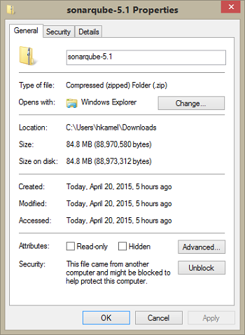
	- Unzip **SonarQube-x.x.zip** on to a drive, for example use **C:\\SonarQube\\SonarQube-5.1**.

		
	- At this point, the installation is complete. **Yes, it is that easy**.
	- Proceed to the next section to complete the configuration of SonarQube.
4. **Configure SonarQube**

	- **>> NOTE >>** This walkthrough assumes the use of the BK VM. If, for example, you are using **SQLExpress** instead, you have to update the connection string. Example:

		```
		sonar.jdbc.url=jdbc:jtds:sqlserver://localhost/Sonar;instance=SQLEXPRESS;SelectMethod=Cursor
		```

	- Alternatively if you are also looking for **integrated security** you can consider:

		```
		sonar.jdbc.url=jdbc:jtds:sqlserver://localhost:1433/sonar;instance=SQLEXPRESS;integratedSecurity=true;authenticationScheme=JavaKerberos
		```

	- Basic configuration of SonarQube consists of making a few updates to the **sonar.properties** file.
	- This file is located in the conf folder located under the SonarQube installation folder.
		Example: **C:\\SonarQube\\SonarQube-5.1\\conf**.
	- You may not want to do this step if you prefer to go with the default SonarQube port **9000**, if available.
	- In the extracted folder navigate to Conf folder, edit **sonar.properties** file to change the default web port or you may need available port. By default SonarQube uses port **9000**.
	- Make sure to assign an available port for SonarQube, you may need to use the **netstat** command to check the currently in use ports.
	- For the purpose of this walkthrough, we assume port **9000** for the FabrikamFiber demo web site.

		
	- Search for the **\# Web Server** section.
	- Uncomment **\#sonar.web.port** and change the port number to any available port, for example **9090**
 
		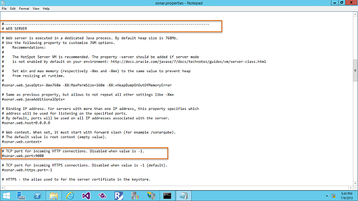

		**>>NOTE >>** Before proceeding with the below configuration steps make sure you have configured SonarQube to use SQL Server database instead of embedded database. 
	
	- Search for and locate the entry for **sonar.jdbc.username**.

		
	- Uncomment (i.e. delete the leading ‘\#’) the two **sonar.jdbc** settings circled in the screenshot above and replace **sonar** in each setting with the database login name and password, respectively.

		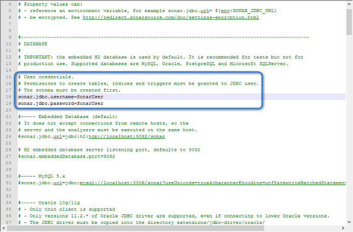
	- Search for and locate the entry for sonar.jdbc.url. There are several copies of this setting based on database type. Make sure you select the entry for Microsoft SQL Server.

		
	- Uncomment (i.e. delete the leading ‘\#’) the sonar.jdbc.url setting circled in the screenshot above and replace the connection string to match the server\\instance and database name for your machine. Example: **sqlserver://.\\SQLExpress/Sonar;SelectMethod=Cursor**

		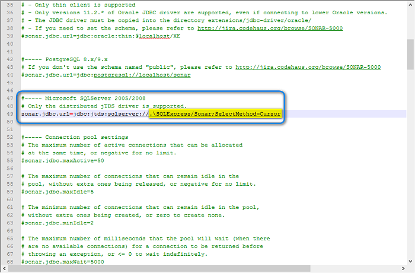
		
		**>> NOTE >>** The jdbc driver installed with SonarQube requires the SQL Server Browser to be running. Check that it is running using the Services Console.

	- Save and close the file.
5. **OPTIONAL - Connect with integrated authenticaton on Windows**
	
	**>> NOTE >>** We tested this configuration in an environment that has no security add-ons. If this does not work in your environment, you need to troubleshoot with your IT departments.
	
	- Please refer to [Building the Connection URL](https://msdn.microsoft.com/en-us/library/ms378428.aspx) for additional details on how to build SQL Server connection string for JDBC.
	- Edit **sonar.properties**.
	- Change the **SQL Server connection** string to use **integrated security**. 

		```
		# Only the distributed jTDS driver is supported. 
		sonar.jdbc.url=jdbc:jtds:sqlserver://localhost;databaseName=sonar;integratedSecurity=true;”
		```

	- If you are using Sonar-runner for analysis, edit **sonar-runner.properties** and add the same configuration. 

		```
		#----- Microsoft SQLServer
		sonar.jdbc.url=jdbc:jtds:sqlserver://localhost;databaseName=sonar;integratedSecurity=true;”
		```

6. **Download and install latest SonarQube C# plugin**
	- Download the latest sonar-csharp-plugin-X.Y.jar. At the time of writing, all versions of the C\# plugin are available from the [C\# Plugin](http://redirect.sonarsource.com/plugins/csharp.html) page, on the SonarQube site.
	- MSBuild and TeamBuild integration is supported since version 4.0 of the plugin.
	- Locate the directory into which the SonarQube was installed e.g. **C:\\SonarQube\\SonarQube-5.1\\**. This directory will have an **extensions\\plugins\\** subdirectory.
	- Copy **sonar-csharp-plugin-X.Y.jar** to this directory from the downloaded package above.
	- Right-click the sonar sonar-csharp-plugin-X.Y.jar and select properties.
	- Click the **Unblock** button to ensure the file is unblocked.
7. **Run**
	- Open Command Prompt and change directory (`cd`) to the extracted folder.

		Example:
		```
		cd C:\SonarQube\SonarQube-5.1\bin\windows-x86-64
		```

	- **>> NOTE >>** You need to run the file corresponding to your operating system.
	- Run **StartSonar.bat**
	- **>> NOTE>>** If you are prompted with a Windows Security Alert asking for network access, click on the Allow access button

		
		 
	- Browse SonarQube web portal using [http://YOUR\_SERVER\_NAME:SONAR\_PORT](http://YOUR_SERVER_NAME:9090). Example: [**http://vsalm:9090**](http://vsalm:9090)

		
	- You should see the default SonarQube web page as shown above. If not, re-validate settings as shown in the previous sections.
	- If the web server does not start, consult the logs in **C:\\SonarQube\\SonarQube-5.1\\logs** to determine possible issues.
8. **Verify the installed SonarQube C# plugin version**
	- Login to SonarQube using admin credentials.
		- If this is the first time you are using SonarQube, the default admin credentials are:
			- Username: admin
			- Password: admin
	- If you log in using the default credentials, it is recommended that you change the password.
	- Verify that the C\# X.Y plugin has been correctly deployed, Navigate to **Settings \>System \> Update Center**.

		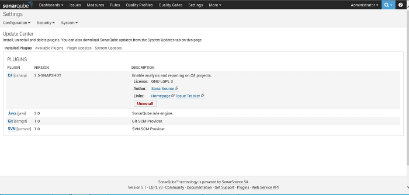
		
	**>> NOTE >>** The screenshot above is based version 3.5. You should see version 4.0 or later.

	**>> NOTE >>** Please refer to section **[Additional Configurations](#additional-configurations)** for more details on how-to configure additional SonarQube configurations that are required for enterprise level deployment.

## Setup of the MSBuild SonarQube Runner on the Build Agent Machine

- You should install it on any machine that will launch SonarQube analysis (example: development machine and build agent).
- In case of installing MSBuild SonarQube Runner on a development machine or build agent, you need to make sure that Java SE Runtime Environment installed on that machine.
- Java SE Runtime Environment installation is not required if Visual Studio 2015 with Android tooling/Cross platform tools are installed since JDK is being installed part of Visual Studio installation.

1. **Extract**
	- Download the latest **MSBuild SonarQube Runner** from the SonarQube [downloads](http://www.sonarqube.org/downloads/).
	- Right-click on the downloaded .zip file and click on the **Unblock** button.

		
	- Unzip **MSBuild.SonarQube.Runner-[version]** on to a drive.
	Example: **C:\\SonarQube\\bin**

2. **Configure**
	- Edit **C:\\SonarQube\\bin\\SonarQube.Analysis.xml** by specifying the following parameters to run against the SonarQube Server we set up earlier.
	- If you are running SonarQube 5.1.x or less, uncomment and set the following properties:
		- `sonar.jdbc.url`
		- `sonar.jdbc.username`
		- `sonar.jdbc.password`

			

3. **OPTIONAL - Update the `%PATH%` environment variable**

	- Add the MSBuild SonarQube Runner executable to the `%PATH%` if you intend to use it from the command line:

		

### Settings File Permissions

- Storing passwords in clear text in unsecured settings files is **not** recommended.
- Restrict access to the **C:\\SonarQube\\bin\\SonarQube.Analysis.xml** file by setting appropriate file permissions.

# Analyze .NET Projects

## From The Command Line

The following assumes that `MSBuild.SonarQube.Runner.exe` has been added to the `%PATH%`.
If that is not your case, simply specify the absolute path to it in both the begin end end phase command.

1. **Run the MSBuild.SonarQube.Runner.exe begin phase**

	```
	MSBuild.SonarQube.Runner.exe begin /key:{SonarQube project key} /name:{SQ project name} /version:{SQ project version}
	```

	The begin phase takes four arguments:

	- begin
	- /key:{the **project key** of the SonarQube project to which the build relates}
	- /name:{the **project name** of the SonarQube project}
	- /version:{the **project version** of the SonarQube project}

	*The aliases /k:, /n: and /v: can also be used.*

	**>>NOTE >>** If any of the arguments contain spaces then that argument needs to be surrounded by double-quotes e.g. **/name:”My Project Name”**.

2. **Launch your normal project build**

	Basic example:

	```
	msbuild
	```

	Example, with nuget:

	```
	nuget restore
	msbuild
	```

3. **Run the MSBuild.SonarQube.Runner.exe end phase**

	```
	MSBuild.SonarQube.Runner.exe end
	```

## From Team Foundation Server 2013
### Mapping Build Definitions to SonarQube projects

SonarQube uses *Projects* to organize analysis results by logical application, where an application can consist of a number of *modules* (assemblies). It is not currently possible to upload partial analysis results for a SonarQube Project. For example, if SonarQube project *X* consists of assemblies *A*, *B* and *C*, it is not possible to build, analyze and upload data for *A* and *B*, and later to build, analyze and upload data for *C*.

This means that a Build Definition must build and analyze all of the assemblies that are in that SonarQube Project.

### Update the build definition

**>> NOTE >> Assumptions**:
- One of the standard Team Build workflow templates for TFS2013 (GitTemplate.12.xaml or TfvcTemplate.12.xaml) and that the standard Microsoft build targets are used. Users who have customized either the build targets or workflow templates may need to modify the following steps to take account of their customizations.
- You have permissions to create or modify a Build Definition. If you do not, contact your Team Foundation Service administrator.

1. **Edit build definition**
	- Open the Team Explorer in Visual Studio.
	- Check that you are connected to the correct Team Foundation Server.

		
	- Click on the **Builds** tab.
	- The displayed **Builds** page will show information about recent builds and any build definitions that exist.
	- Right-click on the build definition you want to modify and select **Edit Build Definition…** 
	- This will display the Build Definition in a document window.

		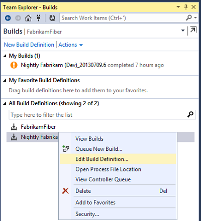

2. **Edit advanced build settings**

	- Click on the Process section, then, within the **2. Build** section, expand the **5. Advanced** section.
	- This will display the advanced build settings.

		
	- Set the following properties in the Advanced section:
		- Set the **Pre-build script path** to the full path to MSBuild.SonarQube.Runner.exe.
		- Set the **Pre-build script arguments** to contain the following four arguments:
			- begin
			- /key:{the **project key** of the SonarQube project to which the build definition relates}
			- /name:{the **project name** of the SonarQube project}
			- /version:{the **project version** of the SonarQube project}

			*The aliases /k:, /n: and /v: can also be used.*

			**>>NOTE >>** If any of the arguments contain spaces then that argument needs to be surrounded by double-quotes e.g. **/name:”My Project Name”**.
		
		- Click on the expander for the **2. Advanced** section under **3. Test** to display the advanced test settings.
		- Set the **Post-test script path** to the full path to MSBuild.SonarQube.Runner.exe
		
			**>> NOTE >>** The pre and post script paths refer to the same executable.

		- Set the **Post-test script arguments** to contain the following argument:
			- end

3. **OPTIONAL - Configure code coverage**

	-  Carry out the following actions if you want to collect code coverage data for tests:
		- Click on the expander **3. Test**
		- Select the **1. Automated tests** line
		- Click on the ellipsis to bring up the **Automated Tests** dialogue.

			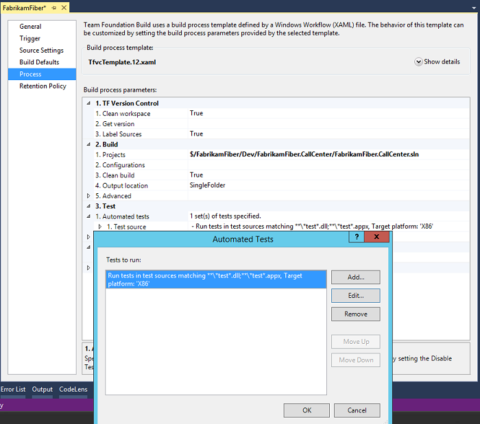
		- Click on **Edit** to bring up the **Add/Edit Test Run** dialog
		- Select **Enable Code Coverage** from **Options** drop-down.

			

		- Click OK to close the dialogs.

			**>>WARNING >>** It is possible to drill down through the **1. Automated tests** sections to locate a drop-down for **Type of run settings** in which one of the options is **CodeCoverageEnabled**. However, at the time of writing choosing **CodeCoverageEnabled** from the drop-down does not generate coverage results, due to a bug. See [TFS 2013 - No Code Coverage Results](http://stackoverflow.com/questions/24016217/tfs-2013-no-code-coverage-results) on StackOverflow for more info. 

4. **Validate and save build settings**
	- The following screenshot shows how the build definition should look at this point.

		

	- **Save** the build definition.

### Test the modified build definition

**>>NOTE >> Assumptions**
- If you have not already created a SonarQube Project with Project Key specified in the Build Definition, a new SonarQube Project will be created automatically, when analysis results are uploaded to SonarQube.
- In this case, the initial analysis will use the default SonarQube Quality Profile.
- If you want the initial analysis to be performed using a different Quality Profile, you will need to create and configure the SonarQube project before running the first analysis.                               
- See the SonarQube documentation on [Provisioning Projects](http://docs.sonarqube.org/display/SONAR/Provisioning+Projects) for more information.

1. **Test the build**
	- Right-click on the build definition in the Team Explorer window.
	- Select **Queue new build…** from the menu.

		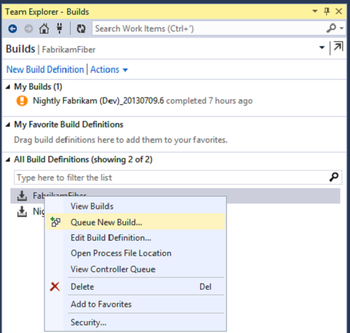
	- A dialogue box will appear presenting various build options.
	- Click on **Queue** to accept the default options and start the build.

		**>> NOTE >>** The build may take some time to complete, depending on the complexity of your application.

	- When the build is complete, the build summary Page will indicate whether the build was successfully or not.
	- If the build completed successfully there will be a section entitled **SonarQube Analysis Summary**.

		
	- The section contains a link to the SonarQube portal for relevant SonarQube Project.

		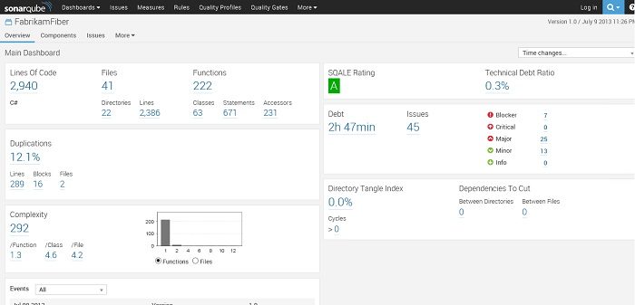

### Troubleshooting

#### Build did not complete successfully and build summary contains one or more errors.

Try modifying the build definition to remove the SonarQube.MSBuild.Runner.exe entries in the pre- and post- script sections. If the build completes successfully, then the errors are related to analysis.

Most analysis-related configuration or execution errors will cause the build to fail and will be appear on the Build Summary. Additional information can be found by viewing the logs or diagnostic information (i.e. by clicking on **View Log**, or **Diagnostics** at the top of the Build Summary page).

# Additional Configurations

### Running SonarQube as a Service on Windows

1. **Uninstall**
	- To **uninstall** the NT services, run the following batch file using Run As Administrator.

		Example:

		```
		<SonarQube_Install_Directory>\bin\windows-x86-64\UninstallNTService.bat
		```

2. **Install**
	- To **install** the NT services, run the following batch file using Run As Administrator.

		Example:

		```
		<SonarQube_Install_Directory>\bin\windows-x86-64\InstallNTService.bat
		```

		
3. **Service Account**
	- Remove the local system account usage and replace it with an administrative account.

		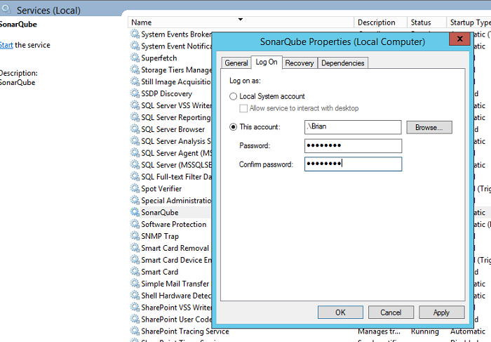

4. **Start service**
	- Make sure you have closed all running non-service instances of **SonarQube Server.**
		- To **start** the service use the Services Console or run the following batch file using Run As Administrator.

		Example:

		```
		<SonarQube_Install_Directory>\bin\windows-x86-64\StartNTService.bat
		```

		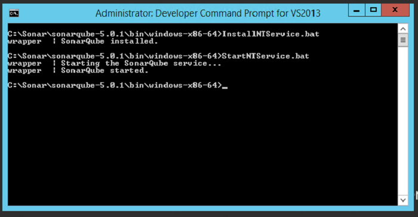

5. **Validate**
	- From Services Console make sure the service is running correctly.

		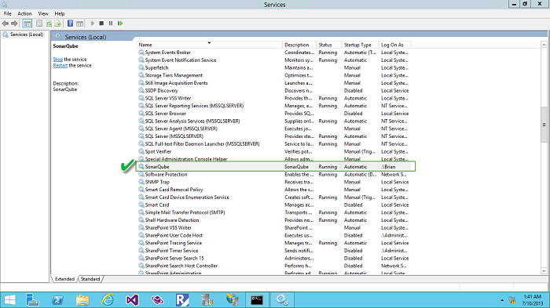
	- Validate that you are able to browse **SonarQube portal**.
6. **Inter-service dependency**
	- If **SonarQube server** is installed on the same machine as SQL Server with the SonarQube database, you need to make sure that SQL Server is started before the SonarQube service. In addition, the default jdbc driver install with SonarQube requires the SQL Brower Service to be running.
	- Assuming you’re using the default SQL Server instance **MSSQLSERVER**, open the command prompt in administrative mode and run the following command to ensure both the SQL Server and SQL Browser Service are started before the SonarQube service.

		```
		Example: sc config SonarQube depend=MSSQLSERVER/SQLBrowser
		```

		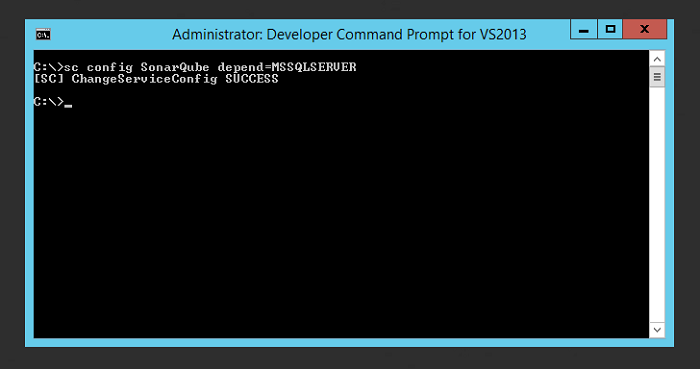

	**>> NOTE >>** If you are using a named SQL instance, you can check the name of the service by locating it in the Services Console and viewing its properties. The **Service name** to use if given on the **General** tab
	- Validate that the inter-service dependency has been added successfully by navigating to the **SonarQube service** and check the **Dependencies** tab.

		

## Configure SonarQube to use Microsoft SQL Database

**>> NOTE >>** For the purposes of this section, we will assume that you have already installed supported version of Microsoft SQL Server (SQL Server 2012) as part of Team Foundation Server installation.
- As mentioned in the database requirements above, SQL Server must be set to **UTF-8** and the language set to **English**. The collation must be set to **case-sensitive** (CS) and **accent-sensitive** (AS).
- To enable TCP connection for SQL, you must open the SQL Server Configuration Manager and enable TCP/IP within SQL Server Network Configuration  and set it to use static port 1433.
- Once a database has been created, you must create a new database user with permissions to create, update, and delete objects within this database.

### Preparations

Before you get to the task of creating a new database for SonarQube, you need to complete a few preparations.

1. **Launch SSMS**
	- Launch **SQL Server Management Studio** (SSMS).
	- Connect to the SQL Server instance on which you plan to create the database.

		```
		Example: .\\SQLExpress
		```

2. **Check collation**
	- Right-click on the **database server** node and select **Properties**. 

		
	- This will display the Server Properties dialog.
	- Click on the **General** node and make a note of the current Server Collation setting.
	- For example, in the screenshot below, the collation setting is currently set to **SQL\_Latin1\_General\_CP1\_CI\_AS**.

		
	- You need the collation to be both **case sensitive** (CS) and **accent sensitive** (AS).
	- If either is different, you will need to be sure to select the case-sensitive version when you set the collation for the database you will be create.
3. **Check authentication**
	- Click on the **Security** node.
	- Since, by default, SonarQube utilizes SQL Authentication we need to ensure that Server Authentication is set to **SQL Server** and **Windows Authentication** mode as shown in the screenshot below.

		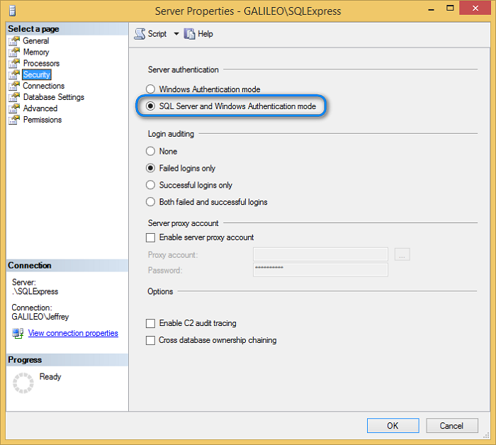

### Walkthrough

1. **Create database for use by SonarQube**
	- Within SSMS right-click on the **Databases** node (just under the Server\\Instance node).
	- Select New Database…

		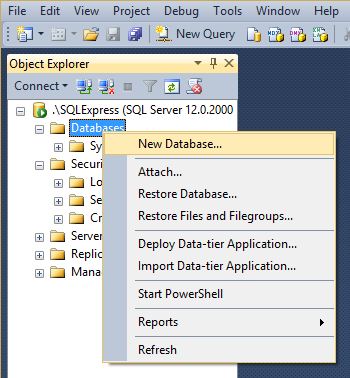
	- In the **General** node, set the Database **Name** to **Sonar**.

		

	- In the **Options** node, click on the **Collation** drop-down list and look for the **case-sensitive** (CS) and **accent-sensitive** (AS) variant of the server collation you made note of above.

		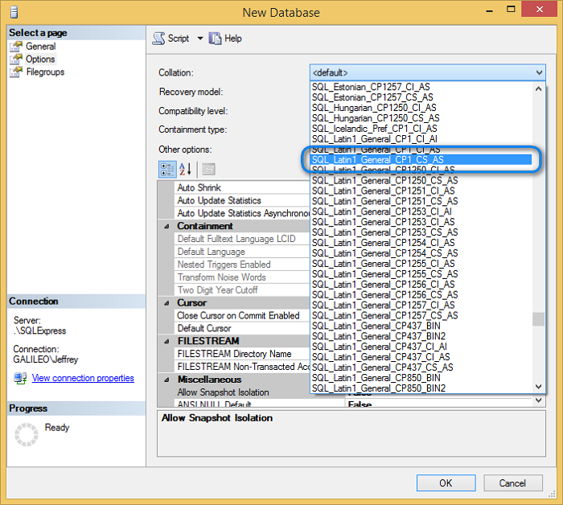
	- Click **OK** to create the initial database.
2. **Create database user for SonarQube**
	- Within SSMS right-click on the **SecurityLogins** node (just under the Server\\Instance node).
	- Select 

		
	- Select the **General** node.
	- Set the Login Name – e.g. SonarUser
	- Select SQL Server Authentication and provide a Password.
	- Uncheck Enforce password expiration.
	- Set the Default Database to the Sonar database you created.
	- Set the **Default Language** to **English** 

		
	- In the **User Mapping** node, ensure the **SonarUser** has been mapped to the **Sonar dat**abase and check the **db\_owner database role membership**                                                                     

		
	- Click **OK** to complete the new user setup.

3. **Test connection**
	- Launch Visual Studio and select **Tools**, **Connect to Database...**

		
	- Select **Microsoft SQL Server** as the Data Source.

		
	- On the **Add Connection** dialog.
		- Set the Server Name to your SQL Server instance (e.g. **.\\SQLExpress**)
		- Select Use SQL Server Authentication and provide the **User Name** and **Password** you created.
		- Enter the name of the database you created, for example Sonar.

			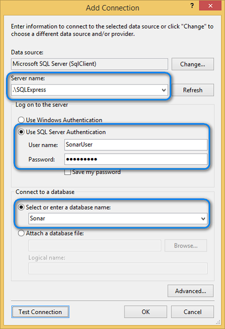
	- Click on Test Connection.
	- You should see the following dialog.

		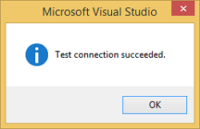

## Secure the SonarQube Portal

By default, the SonarQube portal allows anonymous access, although SonarQube does provide a complete authentication and authorization mechanism to manage security. As users of the portal will be able to view the analyzed source code, it is recommended that the anonymous access to the site not be permitted.

See [Security](http://docs.sonarqube.org/display/SONAR/Security) section on the SonarQube site for more information.

## Conclusion

During our adventure of setting up SonarQube with an existing deployment of Team Foundation Server, we introduced you to Technical Debt; we gave you the prerequisites and installation configurations, and covered the topologies. We hope we have achieved our goals for the guidance, get you up and running quickly with SonarQube and Team Foundation Server so you can start your analysis of your technical debt and begin your debt reduction strategy.

Sincerely
The Microsoft Visual Studio ALM Rangers

The Visual Studio ALM Rangers includes members from the Visual Studio Product group, Microsoft Services, Microsoft Most Valuable Professionals (MVP) and Visual Studio Community Leads. Their mission is to provide out-of-band solutions to missing features and guidance. A growing Rangers Index is available online. 
- [Home](http://aka.ms/vsarunderstand)
- [Solutions](http://aka.ms/vsarsolutions)
- [Membership](http://aka.ms/vsarindex)
- Contributors: Anil Chandra Lingam, Baruch Frei, Brian Blackman, Cesar Solis Brito, Clementino de Mendonca, Darren Rich, Duncan Pocklington, Hosam Kamel, Jean-Marc Prieur, Jeff Bramwell, Marcelo Silva, Mathew Aniyan, Michael Wiley
- Special thanks to: Colin Dembovsky
