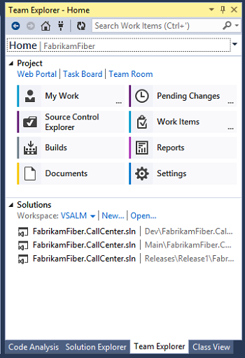
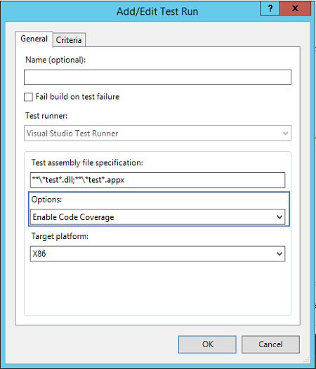
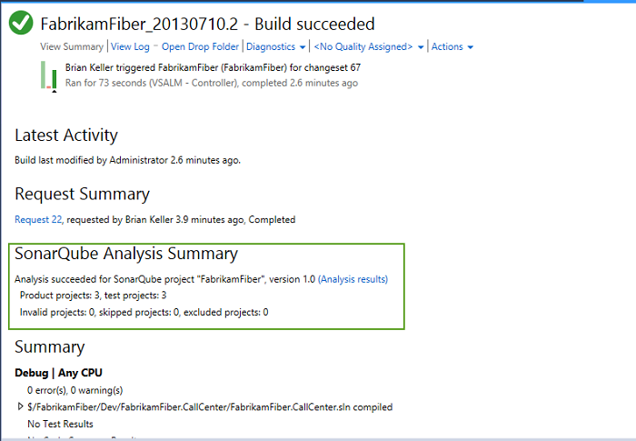
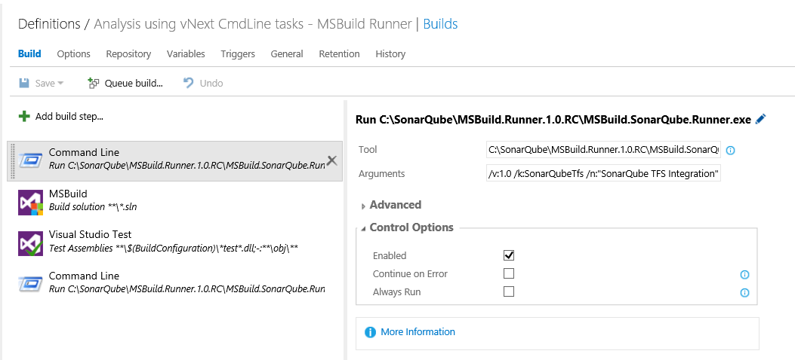

# Analyze .Net Projects From Team Foundation Server 2013 and 2015

## Overview
The [build system](https://msdn.microsoft.com/en-us/library/ms181709(v=vs.120).aspx) in Team Foundation Server 2013 ("TFS 2013") is based on Windows Workflow.
Builds are defined and customised using XAML.
TFS 2015 introduced a [new build system](https://msdn.microsoft.com/en-us/Library/vs/alm/Build/overview) but also supports the legacy "XAML build" system from TFS 2013.

This document describes how to set up to configure a XAML build in TFS 2013 or TFS 2015 to include code analysis. It also gives an outline of how to set up analysis using the new build system.

### Mapping Build Definitions to SonarQube projects

SonarQube uses *Projects* to organize analysis results by logical application, where an application can consist of a number of *modules* (assemblies). It is not currently possible to upload partial analysis results for a SonarQube Project. For example, if SonarQube project *X* consists of assemblies *A*, *B* and *C*, it is not possible to build, analyze and upload data for *A* and *B*, and later to build, analyze and upload data for *C*.

This means that a Build Definition must build and analyze all of the assemblies that are in that SonarQube Project.

## Analyzing projects in XAML Builds in TFS 2013 and TFS 2015

### Additional considerations when using a TFS 2015 XAML build agent
The settings required to configure a XAML build to perform code analysis are the same for TFS 2013 and TFS 2015.
However, if you are using the TFS 2015 XAML build agent then there are additional considerations:
* when analysing data stored in an on-premise TFS installation, the build agent must also have the TFS 2013 Object Model installed
* a TFS 2015 build agent cannot currently be used to analyse code stored in Visual Studio Online ("VSO").
See the following sub-sections for more information.

#### Installing the TFS 2013 Object Model on a TFS 2015 Build Agent
Installing Visual Studio 2013 will install the necessary assemblies on the build agent.
Alternatively, Microsoft provide a separate installer for the object model that can be downloaded and installed as follows:
* Browse to the [Visual Studio Gallery](https://visualstudiogallery.msdn.microsoft.com/)
* Search for "Team Foundation Server Object Model"
* Choose the appropriate version of the 2013 object model for the updates you have applied to your TFS installation
* Download and run the installer

#### Analyzing code stored in Visual Studio Online ("VSO") requires a TFS 2013 build agent
If you are analysing code stored in VSO using a XAML build then at present you must use TFS 2013 build agent.
This is a known issue that is being tracked here [http://jira.sonarsource.com/browse/SONARMSBRU-73].

### Updating an existing XAML build definition

**>> NOTE >> Assumptions**:
- One of the standard Team Build workflow templates for TFS2013 (GitTemplate.12.xaml or TfvcTemplate.12.xaml) and that the standard Microsoft build targets are used. Users who have customized either the build targets or workflow templates may need to modify the following steps to take account of their customizations.
- You have permissions to create or modify a Build Definition. If you do not, contact your Team Foundation Service administrator.

1. **Edit build definition**
	- Open the Team Explorer in Visual Studio.
	- Check that you are connected to the correct Team Foundation Server.

		
	- Click on the **Builds** tab.
	- The displayed **Builds** page will show information about recent builds and any build definitions that exist.
	- Right-click on the build definition you want to modify and select **Edit Build Definition…** 
	- This will display the Build Definition in a document window.

		

2. **Edit advanced build settings**

	- Click on the Process section, then, within the **2. Build** section, expand the **5. Advanced** section.
	- This will display the advanced build settings.

		
	- Set the following properties in the Advanced section:
		- Set the **Pre-build script path** to the full path to MSBuild.SonarQube.Runner.exe.
		- Set the **Pre-build script arguments** to contain the following four arguments:
			- begin
			- /key:{the **project key** of the SonarQube project to which the build definition relates}
			- /name:{the **project name** of the SonarQube project}
			- /version:{the **project version** of the SonarQube project}

			*The aliases /k:, /n: and /v: can also be used.*

			**>>NOTE >>** If any of the arguments contain spaces then that argument needs to be surrounded by double-quotes e.g. **/name:”My Project Name”**.
		
		- Click on the expander for the **2. Advanced** section under **3. Test** to display the advanced test settings.
		- Set the **Post-test script path** to the full path to MSBuild.SonarQube.Runner.exe
		
			**>> NOTE >>** The pre and post script paths refer to the same executable.

		- Set the **Post-test script arguments** to contain the following argument:
			- end

3. **OPTIONAL - Configure code coverage**

	-  Carry out the following actions if you want to collect code coverage data for tests:
		- Click on the expander **3. Test**
		- Select the **1. Automated tests** line
		- Click on the ellipsis to bring up the **Automated Tests** dialogue.

			
		- Click on **Edit** to bring up the **Add/Edit Test Run** dialog
		- Select **Enable Code Coverage** from **Options** drop-down.

			

		- Click OK to close the dialogs.

			**>>WARNING >>** It is possible to drill down through the **1. Automated tests** sections to locate a drop-down for **Type of run settings** in which one of the options is **CodeCoverageEnabled**. However, at the time of writing choosing **CodeCoverageEnabled** from the drop-down does not generate coverage results, due to a bug. See [TFS 2013 - No Code Coverage Results](http://stackoverflow.com/questions/24016217/tfs-2013-no-code-coverage-results) on StackOverflow for more info. 

4. **Validate and save build settings**
	- The following screenshot shows how the build definition should look at this point.

		

	- **Save** the build definition.

### Test the modified build definition

**>>NOTE >> Assumptions**
- If you have not already created a SonarQube Project with Project Key specified in the Build Definition, a new SonarQube Project will be created automatically, when analysis results are uploaded to SonarQube.
- In this case, the initial analysis will use the default SonarQube Quality Profile.
- If you want the initial analysis to be performed using a different Quality Profile, you will need to create and configure the SonarQube project before running the first analysis.                               
- See the SonarQube documentation on [Provisioning Projects](http://docs.sonarqube.org/display/SONAR/Provisioning+Projects) for more information.

1. **Test the build**
	- Right-click on the build definition in the Team Explorer window.
	- Select **Queue new build…** from the menu.

		
	- A dialogue box will appear presenting various build options.
	- Click on **Queue** to accept the default options and start the build.

		**>> NOTE >>** The build may take some time to complete, depending on the complexity of your application.

	- When the build is complete, the build summary Page will indicate whether the build was successfully or not.
	- If the build completed successfully there will be a section entitled **SonarQube Analysis Summary**.

		
	- The section contains a link to the SonarQube portal for relevant SonarQube Project.

		

### Troubleshooting

#### Build did not complete successfully and build summary contains one or more errors.

Try modifying the build definition to remove the SonarQube.MSBuild.Runner.exe entries in the pre- and post- script sections. If the build completes successfully, then the errors are related to analysis.

Most analysis-related configuration or execution errors will cause the build to fail and will be appear on the Build Summary. Additional information can be found by viewing the logs or diagnostic information (i.e. by clicking on **View Log**, or **Diagnostics** at the top of the Build Summary page).

## Analyzing projects using the new TFS 2015 build system
The intention is to provide custom tasks to make the process of performing SonarQube analysis in the TFS build system straightfoward.
The proposed custom build tasks will also make it possible to run SonarQube analysis on hosted build agents.

However, it is currently possible to perform SonarQube analysis in the new build system on an on-premise build agent by using the general-purpose "Command Line" task to call *MSBuild.SonarQube.Runner.exe* (i.e. to do the same job as the "Pre-Build script"/"Post-Build script" steps in a XAML build).
The following steps provide an outline of how to set this up:

* Create an on-premise VSO 2015 build agent using the instructions [here](https://msdn.microsoft.com/Library/vs/alm/Build/agents/windows)
* Install the *MSBuild.SonarQube.Runner* on the build agent
* Create a new build definition that includes the *MSBuild* and (optionally) *Visual Studio Test* steps
* Add *Command Line* build step before the *MSBuild* step and after the *Visual Studio Test* step
* In the pre-build command line:
  * set the *Tool* field to point to the *MSBuild.SonarQube.Runner.exe*
  * supply the necessary arguments in the *Arguments* field e.g. *begin */key:my.project /name:"My Project" /version:1.0*
  * supply the the SonarQube server URL and credentials either in the *Arguments* field or in a settings file e.g. */d:sonar.host.url=http://mySonarQube:9000*

* In the post-build command:
  * set the *Tool* field to point to the *MSBuild.SonarQube.Runner.exe*
  * set the *Arguments* field to *end*
* Save the build definition

By default a new build definition will run both *debug* and *release* builds.  SonarQube can only analyse one type of build at a time so you will need to pick one or the other (*Variables* tab, *BuildConfiguration* property).

The following screenshot gives an example of how the build definition would look.

