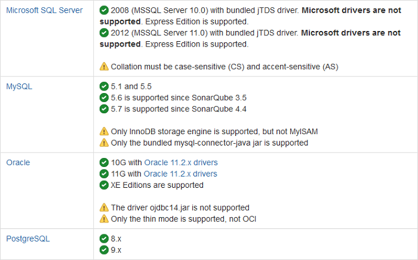

# Prerequisites 

At the time of this writing, the current version of SonarQube, v5.1, had the following requirements.

## Java
A Java runtime is required for SonarQube to run. Supported JVMs:
-   Java (Oracle JRE 7 or greater or OpenJDK 7 or greater).

### Database

Regardless of which database solution you choose, it must be set to **UTF-**8, language set to **English**, and collation to CS (case sensitive) and AS (accent sensitive).

Figure – Database prerequisites

### Web Browser

For the best SonarQube experience ensure to enable JavaScript in your web browser. Supported web browsers:

Figure – Web browser prerequisites

### Hardware

-   At least 1GB RAM
-   Disk space requirements vary dependent upon the size and number of projects you wish to analyze using SonarQube. As a point of reference, [Nemo](http://nemo.sonarsource.org/), the public instance of SonarQube, currently analyzes over 15 million lines of source code, which includes four years of history. Nemo is currently using about 10GB of disk space.
-   SonarQube relies on intensive hard drive I/O for indexing purposes. You should install SonarQube on the most performant hard drive you have at your disposal for best results.

### File Encoding

SonarQube assumes that all of the source files have the same file encoding. Currently, the MSBuild SonarQube Runner expect this to be UTF-8. Non-compliance will result in incorrect analysis and display when viewed in the SonarQube portal (for example when drilling down to view the source associated with an issue).

**>> NOTE >>** For the most up to date information on SonarQube requirements, check out the [requirements](http://docs.sonarqube.org/display/SONAR/Requirements).